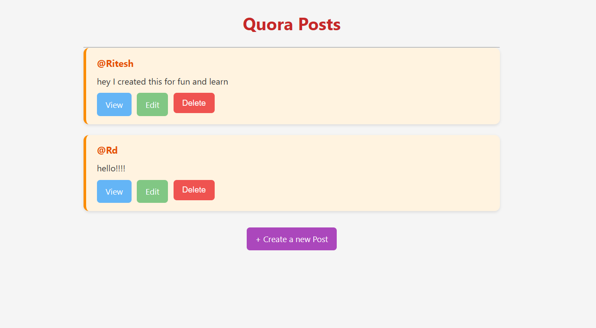
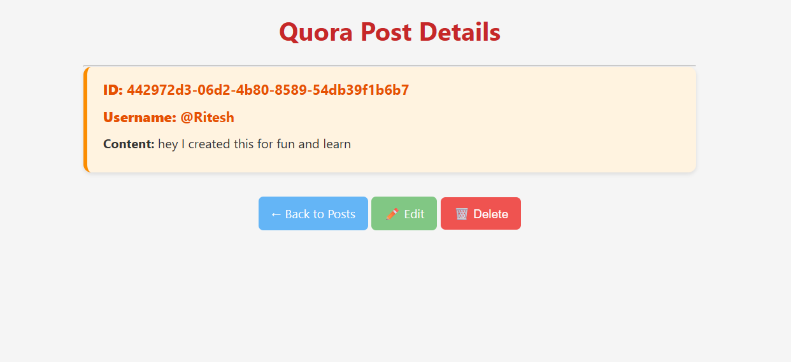
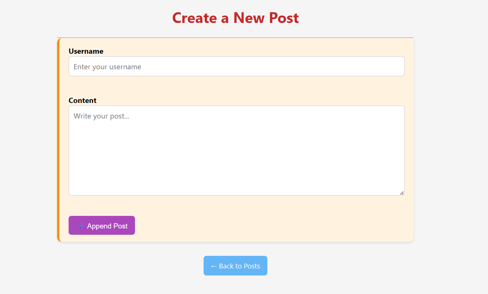
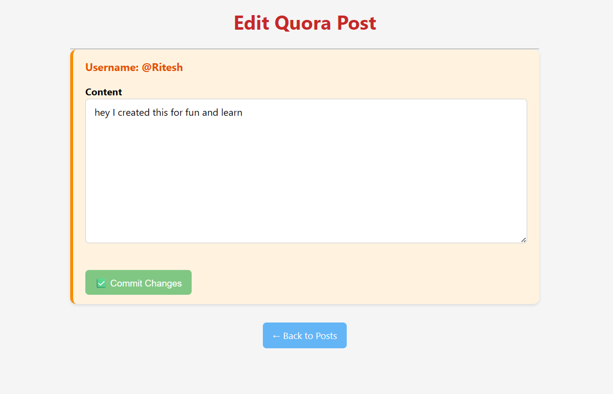

# 📘 Quora Simple Blog Website


> A beginner-friendly project to **learn RESTful API** design, while also building a **simple Quora-like blog** website.

---

## 🚀 Tech Stack

- ⚙️ **Backend**: Node.js, Express.js, Java
- 🎨 **Frontend**: HTML, CSS, EJS (Embedded JavaScript)
- 📦 **Packages Used**:
  - `express` – for creating the REST API and server
  - `ejs` – for templating dynamic pages
  - `uuid` – to generate unique post IDs
  - `method-override` – to enable PUT & DELETE from forms

---

## ✨ Features

- 🗂️ List all posts
- 📝 Create a new post
- 🔍 View individual posts
- ✏️ Edit existing posts
- 🗑️ Delete posts

Each post includes:
- ✅ **Username**
- 🆔 **Unique ID**
- 💬 **Content**

---

## ⚙️ Installation & Local Setup

> Follow these steps to run the Quora Simple Blog on your local machine.

### 1. 📁 Clone the Repository

```bash
git clone https://github.com/your-username/quora-simple-blog.git
cd quora-simple-blog
```

### 2. 📦 Install Dependencies
```bash
npm install
```


--- 


## 🔍 Packages Explained
Package	Description
express	Core web framework to build routes and REST API
ejs	Templating engine to render dynamic HTML
uuid	Generates unique IDs for each blog post
method-override	Allows HTML forms to use PUT and DELETE methods


---

## 3. ▶️ Run the Application

node app.js
The app will run locally on:
bash
```
🌐 http://localhost:8080
```


---

## 📡 What is a REST API?
REST (Representational State Transfer) is an architectural style used to design scalable web services.
A REST API uses standard HTTP methods (GET, POST, PUT, DELETE) to let clients interact with server-side resources.

Each operation in a RESTful app targets a specific endpoint (URL path) that represents a resource — like a blog post.

---

## 🛣️ How We Choose API Routes (Paths)
In this project, RESTful routes are carefully designed to match the intent of each HTTP method:

| HTTP Method | Route         | Purpose                  |
|-------------|---------------|--------------------------|
| GET         | `/posts`      | List all posts           |
| GET         | `/posts/:id`  | View a specific post     |
| POST        | `/posts/new`  | Create a new post        |
| PATCH       | `/posts/:id`  | Update an existing post  |
| DELETE      | `/posts/:id`  | Delete a post            |


Each route clearly reflects the resource (/posts) and action (create, read, update, delete).

These routes follow REST principles, making the app easy to understand, scale, and maintain — just like how professional APIs (like Twitter or GitHub) are built.

---

## 💡 Purpose of this Project
This project is built with the goal of:

✨ Understanding RESTful API architecture

✨ Getting hands-on with CRUD operations

✨ Exploring how a Quora-like blog works

✨ Bridging the gap between frontend and backend using EJS


---


## 📸 Screenshots


    
   

---


## 🤝 Contribution
Contributions are welcome!
If you have ideas to improve this project or make it even more beginner-friendly:

1 Fork the repo

2 Create a new branch (git checkout -b feature-name)

3 Commit your changes

4 Open a Pull Request

5 Let’s learn and grow together! 💪


---


## 📄 License
This project is licensed under the MIT License — free to use, share, and modify.


---


## 🌟 Show Your Support
If you like this project:

⭐ Star this repo
🔁 Share with friends
🍴 Fork and build your version

---

## Made with ❤️ to help developers understand REST API fundamentals in a fun and practical way.


---

✅ You can now:
- Paste this into your `README.md`
- Add screenshot images to a `screenshots/` folder (optional)
- Replace `your-username` with your GitHub handle in the clone URL

Let me know if you want a **live demo badge**, **GitHub stats**, or **project logo** at the top!


